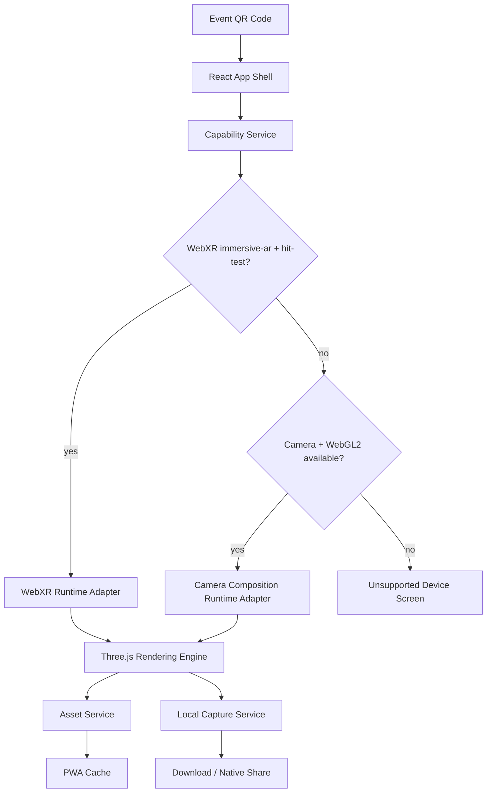

# DOST WebAR Mascot Experience Architecture

## Source Of Truth

The product requirements document is the source of truth for business behavior. This architecture reflects the PRD and subsequent stakeholder clarifications:

- Mobile browser WebAR experience launched from a QR code.
- Android Chrome and iPhone Safari are primary targets.
- WebXR markerless floor AR is used where supported.
- iOS remains entirely inside the web application for MVP.
- Photos remain local to the user's device.
- No account system, no authentication, and no server image processing.
- Production analytics are disabled unless DOST explicitly approves them.

## Architecture Goals

- Provide the best available AR experience per device capability.
- Preserve a single web-based user journey from QR scan to saved/shared photo.
- Avoid MVP vendor lock-in and recurring commercial WebAR licensing.
- Meet mobile performance targets on representative mid-range devices.
- Keep privacy, security, and offline behavior simple and auditable.

## Runtime Experience

1. User scans event QR code.
2. Browser opens the web app over HTTPS.
3. App performs capability checks without requesting camera permission.
4. User selects one of four mascots.
5. Selected mascot model is lazy loaded.
6. User taps the AR start control.
7. Browser requests camera or WebXR permission.
8. App chooses the best runtime:
   - WebXR markerless AR when supported.
   - In-browser camera-composition fallback when WebXR AR is unavailable.
   - Informative unsupported state when neither path is possible.
9. User places, rotates, scales, and photographs the mascot.
10. Photo is generated locally and downloaded or shared through device capabilities.

## High-Level System



## Major Modules

### App Shell

Owns application boot, routing, mobile-only guardrails, global error boundaries, and UI composition. It should not contain Three.js scene logic.

### Capability Service

Detects browser and device capabilities:

- Mobile form factor.
- WebGL2.
- WebAssembly.
- WebXR and `immersive-ar`.
- WebXR hit-test capability.
- Camera access availability.
- Native share support.
- Coarse memory/performance hints where available.

Capability detection must be feature-based rather than based on exhaustive model lists.

### Experience Controller

Coordinates the user journey and session state. It selects the runtime adapter and exposes high-level commands such as `selectMascot`, `startExperience`, `placeMascot`, `capturePhoto`, and `endSession`.

### Runtime Adapters

Runtime adapters isolate platform-specific AR behavior behind a shared interface.

Required MVP adapters:

- `WebXRRuntimeAdapter`: Android markerless AR with hit testing and floor placement.
- `CameraCompositionRuntimeAdapter`: iOS and fallback camera feed with manual placement.
- `UnsupportedRuntimeAdapter`: user-facing explanation and recovery path.

### Rendering Engine

Owns Three.js renderer, scene, camera, lights, animation mixers, model lifecycle, and frame loop. React state must not be updated every frame.

### Asset Service

Loads mascot assets using a manifest. It must load only the selected mascot initially, validate asset metadata, and release inactive resources.

### Capture Service

Generates photos locally. It must never upload, store, or transmit camera imagery.

### PWA Service

Registers service worker, manages repeat-visit caching, and exposes cache state to the UI.

## Session State Model

Use explicit session states rather than loose boolean flags.

```text
idle
checkingCapabilities
selectingMascot
loadingMascot
readyToStart
requestingPermission
startingRuntime
detectingSurface
placingMascot
mascotPlaced
capturing
captureReady
ending
error
unsupported
```

## WebXR Runtime Lifecycle

1. Confirm `navigator.xr` exists.
2. Check `isSessionSupported("immersive-ar")`.
3. Start session only from user gesture.
4. Request required features:
   - `hit-test`
   - `local` or `local-floor` reference space
5. Request optional features where available:
   - `dom-overlay`
   - anchors if supported and justified
6. Create hit-test source.
7. Render placement reticle while a surface is detected.
8. Place mascot on user tap.
9. Keep mascot transform editable.
10. Pause/resume when session visibility changes.
11. End session and dispose resources.

## iOS Camera-Composition Runtime Lifecycle

1. Start only from user gesture.
2. Request camera with `getUserMedia`.
3. Display full-screen camera stream.
4. Render mascot using Three.js over the stream.
5. Provide manual placement controls:
   - drag position
   - pinch scale
   - rotate control
6. Capture by compositing camera frame and WebGL canvas locally.
7. Stop camera tracks on session end.

This fallback is less spatially accurate than WebXR but preserves the required in-browser user journey.

## UI Architecture

The UI must be mobile-first and event-friendly:

- Large touch targets.
- High contrast.
- Clear permission copy.
- Minimal steps.
- Safe-area support for modern iPhones.
- No desktop production experience beyond unsupported messaging.

Main screens:

- Loading / capability check.
- Mascot selection.
- Permission start screen.
- WebXR placement session.
- Camera-composition fallback session.
- Capture preview.
- Error and unsupported states.

## Asset Architecture

Production mascot targets:

- Format: GLB.
- Geometry compression: Draco.
- Texture compression: KTX2/BasisU.
- Triangles: 20,000-50,000 per mascot.
- Texture size: 1024x1024 preferred, 2048x2048 maximum.
- Required animation: idle.
- Recommended animation: wave.
- Optional animation: pose.

Each mascot should have manifest metadata:

- id
- display name
- model URL
- thumbnail URL
- version
- file size
- triangle count
- texture budget
- animation clips
- default scale
- default vertical offset

## Offline Behavior

Cold-start offline is not required. After a successful first visit, the app should cache:

- App shell.
- Runtime chunks.
- Mascot metadata.
- Mascot thumbnails.
- Previously loaded mascot models.
- Essential UI assets.

The app must clearly explain when a requested mascot is unavailable offline.

## Error Handling

All runtime errors should map to user-facing messages:

- Unsupported browser.
- Desktop device.
- Camera permission denied.
- WebXR session failed.
- Asset failed to load.
- Low memory or degraded performance.
- Capture failed.
- Offline asset unavailable.

Error messages should tell the user what they can do next without exposing technical stack traces.

## Privacy And Security

- HTTPS only.
- Camera requested only after user starts AR.
- No image upload.
- No PII collection.
- No GPS collection.
- No account system.
- Analytics disabled in production unless approved.

## Acceptance Matrix

Minimum supported platform baselines:

- Android 13+.
- iOS 17+.

Representative test devices are defined in `docs/DeviceSupportMatrix.md`.

