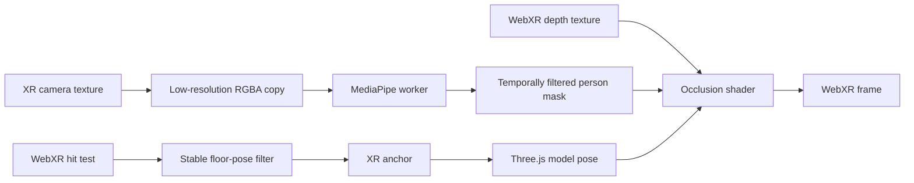

# WebXR World Placement and Human Occlusion Research

Date: 20 July 2026

## Executive conclusion

This is feasible in a mobile browser on supported Android devices, but the best result is not produced by body landmarks alone. The recommended design combines three independent signals:

1. **WebXR hit testing plus anchors** for stable, meter-scale placement on a detected floor.
2. **WebXR depth sensing** for physically correct real-world/virtual-world ordering.
3. **On-device person segmentation** for a clean human silhouette when WebXR depth is missing, noisy, or weak around hair, clothing, and moving limbs.

The correct rendering rule is:

```text
hide a virtual pixel when
  validRealDepth && realDepth < virtualDepth - bias
or
  confidentPersonMask
```

The person mask remains active alongside native depth so it can repair noisy or incorrect depth pixels around people. This deliberately gives a detected person foreground priority and looks convincing for a photo opportunity, but it cannot determine whether that person is actually in front of or behind the virtual object. A 2D mask contains no absolute world depth.

For this repository, the recommended first production target is **Chrome on ARCore-capable Android**. The existing iOS camera-composition path can support person foreground compositing, but it cannot provide equally accurate markerless world placement because Safari on iPhone does not currently expose `immersive-ar` WebXR.

## What each technology solves

| Problem | Correct technology | Why |
| --- | --- | --- |
| Find a floor point | WebXR hit test | A ray is intersected with the XR system's understanding of planes, points, or meshes. |
| Keep the model fixed in the room | WebXR anchor | The runtime can refine the pose as its understanding of the room changes. |
| Know whether real geometry is closer than the model | WebXR depth sensing | It provides camera-aligned distance values for real-world geometry. |
| Obtain a person's exact silhouette | Person segmentation | It returns a per-pixel human/background probability mask. |
| Recognize body joints or gestures | Pose Landmarker | It returns 33 pose landmarks and optional masks, but landmarks alone are not suitable for occlusion. |

WebXR hit testing is specifically designed to align virtual content with a real surface. The Anchors specification says native anchors should maintain a pose as though it were fixed relative to the real world. WebXR Depth Sensing explicitly lists occlusion as a use case. Sources: [WebXR Hit Test](https://immersive-web.github.io/hit-test/), [WebXR Anchors](https://immersive-web.github.io/anchors/), and [WebXR Depth Sensing](https://immersive-web.github.io/depth-sensing/).

## Recommended runtime architecture



### Capability ladder

Use progressive enhancement rather than making every feature mandatory:

| Tier | Features | Result |
| --- | --- | --- |
| A | Hit test + anchor + depth + camera access + person mask | Stable placement and physically correct human/environment occlusion, with refined human edges. |
| B | Hit test + anchor + depth | Stable placement and real-world occlusion; no ML silhouette refinement. |
| C | Hit test + anchor + camera access + person mask | Stable placement; detected people are forced in front, but front/behind ordering is not physically testable. |
| D | Hit test only | Current Android behavior: stable-enough placement but virtual content always renders over the camera view. |
| E | Camera composition + person mask | Convincing human foreground on iOS/fallback, but model position is screen-relative rather than true markerless world placement. |

Chrome's ARCore/WebXR comparison lists Hit Test, Anchors, Depth API, and Lighting Estimation as shipped WebXR features. Plane Detection shipped in Chrome 147 and can be used as an optional improvement for identifying horizontal planes and their polygon bounds. Sources: [WebXR compared with ARCore](https://developers.google.com/ar/develop/webxr/arcore-comparison), [Chrome 147 release notes](https://developer.chrome.com/release-notes/147), and [WebXR Plane Detection](https://immersive-web.github.io/plane-detection/).

## Accurate world placement

The current application already requests `hit-test`, obtains a viewer-space hit-test source, and copies the selected hit matrix into the mascot root. That is a sound MVP, but it leaves four improvements for production-quality placement.

### 1. Request and use anchors

Add `anchors` as an optional session feature. On placement, prefer `XRHitTestResult.createAnchor()`. Store the resulting `anchorSpace`, then update the model every XR frame from:

```ts
const pose = frame.getPose(anchor.anchorSpace, placementReferenceSpace);
```

If anchors are unavailable or creation fails, retain the current matrix-copy behavior. An anchor created from a hit result may be attached to the real-world entity that produced the hit, allowing the device to refine the virtual pose as mapping improves. See [WebXR Anchors](https://immersive-web.github.io/anchors/).

### 2. Reject unstable or non-floor hits

Do not allow placement after one arbitrary hit. Keep a short rolling window, for example 10-15 poses over 300-500 ms, and enable placement only when:

- the hit normal is close to world up (for example, dot product greater than 0.9);
- position spread is below a device-tested threshold (initial target: 2 cm);
- normal-angle spread is small (initial target: 3 degrees); and
- the hit remains continuously available.

When `plane-detection` is granted, additionally require a horizontal plane and confirm the hit lies inside its polygon. Treat semantic label `floor` as a positive signal, not a requirement, because semantic labels are optional.

### 3. Preserve real units and a floor-contact pivot

GLB assets should be authored in meters. Continue aligning the model's bottom bounding-box point to y=0 and keep a known target height in meters. Placement accuracy can be spatially correct while still looking wrong if the asset pivot, scale, or contact shadow is incorrect.

### 4. Be precise about “accurate”

Hit tests and local anchors provide accurate placement **during the current XR session**. They do not automatically provide shared placement between phones or reliable restoration on a later visit. Persistent/shared placement is a separate requirement and has a much narrower support surface.

## Human occlusion

### Primary path: WebXR depth

Request `depth-sensing` and provide the required `depthSensing` configuration. Prefer `gpu-optimized` because the result is consumed by a fragment shader, then fall back to `cpu-optimized`. Prefer `smooth` depth for visual occlusion.

```ts
const sessionInit = {
  requiredFeatures: ["hit-test"],
  optionalFeatures: [
    "local-floor",
    "anchors",
    "depth-sensing",
    "plane-detection",
    "camera-access",
    "light-estimation",
    "dom-overlay"
  ],
  depthSensing: {
    usagePreference: ["gpu-optimized", "cpu-optimized"],
    dataFormatPreference: ["float32", "luminance-alpha", "unsigned-short"],
    depthTypeRequest: ["smooth", "raw"],
    matchDepthView: true
  }
};
```

For each XR view, obtain depth information and pass its texture, `normDepthBufferFromNormView`, and `rawValueToMeters` into the Three.js material shader. Compute the virtual fragment's camera-plane depth and discard or fade it when valid real depth is closer. Depth value `0` means invalid and must not occlude. Use a small metric bias (start testing around 1-3 cm) and a narrow feather to avoid noisy edges and z-fighting. The exact depth formats and transforms are defined by [WebXR Depth Sensing](https://immersive-web.github.io/depth-sensing/).

Depth sensing is the only browser path in this design that can correctly decide both cases:

- person in front of mascot -> person occludes mascot;
- person behind mascot -> mascot remains visible.

### Refinement/fallback path: MediaPipe Image Segmenter

Use `@mediapipe/tasks-vision` Image Segmenter with **SelfieSegmenter square** first. It produces human/background confidence per pixel from a 256 x 256 input. The landscape model is 144 x 256. Google's current Pixel 6 benchmark is approximately 33-35 ms per frame for either CPU or GPU; the heavier multiclass and DeepLab models are substantially slower. Source: [MediaPipe Image Segmenter overview and benchmarks](https://developers.google.com/edge/mediapipe/solutions/vision/image_segmenter/index).

The model card identifies important limits: it is designed for prominent humans, is out of scope for people beyond about 4 m and for groups at very different scales, and may miss fingers or degrade under fast motion, weak light, noise, or large occluders. Source: [Selfie Segmentation model card](https://storage.googleapis.com/mediapipe-assets/Model%20Card%20MediaPipe%20Selfie%20Segmentation.pdf).

Recommended mask pipeline:

1. Downsample the aligned XR camera frame to the model's native resolution.
2. Run inference in a Web Worker; MediaPipe documents that video calls are synchronous and otherwise block the UI thread.
3. Run at an adaptive 8-15 inference frames per second while rendering XR at the device frame rate.
4. Keep the latest mask as a GPU texture.
5. Apply temporal smoothing, a 1-2 pixel dilation, and a small edge feather.
6. Use the mask to fill invalid/noisy areas in the real-depth result.

MediaPipe's web guide explicitly recommends a worker to prevent `segmentForVideo()` from blocking the UI thread: [Image segmentation guide for web](https://developers.google.com/edge/mediapipe/solutions/vision/image_segmenter/web_js).

### Why not Pose Landmarker by default?

Pose Landmarker can return a segmentation mask as well as 33 image and world landmarks. Choose it only if the experience also needs poses, gestures, or character interaction. For pure occlusion, Image Segmenter is the narrower and more appropriate task. Also, Pose Landmarker “world” landmarks are expressed in meters around the person's hip midpoint; they are not automatically registered to WebXR's room coordinate system and therefore do not replace WebXR depth or anchors. Source: [Pose Landmarker web guide](https://developers.google.com/edge/mediapipe/solutions/vision/pose_landmarker/web_js).

## Getting the XR camera into the ML model

The application already requests `camera-access` and uses `XRWebGLBinding.getCameraImage()`. That is the required source for a frame synchronized and aligned with the XR view. The specification says the returned texture is opaque, owned by the user agent, and should be treated as read-only. It does **not** guarantee that the texture can be attached directly to an application framebuffer. Source: [WebXR Raw Camera Access](https://immersive-web.github.io/raw-camera-access/).

For robustness, avoid using the current direct `framebufferTexture2D()` readback strategy as the long-term ML input path. Instead:

1. Sample the opaque camera texture in a simple WebGL shader.
2. Render it into an application-owned RGBA8 render target at 256 x 256.
3. Transfer that small frame to an `OffscreenCanvas`/worker-compatible image.
4. Run segmentation there.

This still introduces a GPU-to-CPU synchronization point, so it should happen only at the ML cadence, not every XR frame. Keep the raw camera, masks, and captures on-device. Raw camera access has substantial privacy implications and requires both camera and `xr-spatial-tracking` permissions policy; the browser is expected to show a camera privacy indicator.

## Rendering implementation

Two viable Three.js implementations exist.

### Option 1: patch model materials

Use `material.onBeforeCompile` or dedicated `ShaderMaterial` variants to sample real depth and the person mask. Discard the mascot fragment when the hybrid occlusion rule says real content is closer. This is the most direct approach and also supports soft feathering.

### Option 2: depth-only screen-space occluder

Render a full-screen quad before the mascots with `colorWrite=false` and `depthWrite=true`. Discard non-person pixels; for person pixels, write near depth. This is simpler for “person always in front,” but it cannot express physically correct front/behind ordering without also sampling WebXR depth.

Option 1 is recommended because the same shader can combine valid real depth with the human mask and can be reused in the capture renderer.

The saved photo must use the same mask/depth rule as the live view. Otherwise the live preview may show the person in front while the captured image places the model over them. The current capture pipeline should therefore cache the latest synchronized person mask and, where practical, the latest CPU-readable depth data or an occluded virtual render.

## Platform reality

| Platform | World placement | Human foreground | Recommended support statement |
| --- | --- | --- | --- |
| Android Chrome + ARCore + depth | True markerless placement; anchors and depth available by capability | Physically correct depth plus segmentation refinement | Full experience |
| Android Chrome + ARCore, no depth | True markerless placement | Person-mask fallback, always foreground | Enhanced fallback |
| iPhone Safari | No equivalent immersive WebXR AR path in the current app | Person segmentation works over `getUserMedia` | Photo composition, not accurate markerless placement |
| Unsupported/in-app browser | Unreliable | Unreliable | Ask user to open supported browser |

Apple's published Safari material describes WebXR `immersive-vr` on visionOS, while an Apple engineer states that `immersive-ar` is not supported on visionOS or iOS. A 2026 WebKit bug also corrected a false positive that reported immersive AR support on visionOS. Sources: [Apple developer forum answer](https://developer.apple.com/forums/thread/756850), [Safari 18 WebXR release](https://webkit.org/blog/15865/webkit-features-in-safari-18-0/), and [WebKit bug 305459](https://bugs.webkit.org/show_bug.cgi?id=305459).

If equally accurate iPhone floor placement is a hard requirement, the product must relax at least one current constraint: use a native ARKit/App Clip route, adopt a proven commercial WebAR runtime that supplies its own iOS world tracking, or use a known-size visual marker. The existing MindAR image-tracking path can support the marker option, but it is not equivalent to markerless floor SLAM.

## Changes mapped to this repository

| Area | Current state | Recommended change |
| --- | --- | --- |
| `src/app/App.tsx` | Requests hit test and camera access, with DOM overlay retries | Add optional anchors, depth sensing, plane detection, and light estimation; record the actual granted tier. |
| `src/types/webxr.d.ts` | Contains only hit-test and raw-camera types | Add current depth, anchor, plane, `enabledFeatures`, and pose types, or adopt a maintained WebXR type package if compatible. |
| `src/ar/WebXRSession.tsx` placement | Copies a hit matrix once | Retain the hit object at selection, create an anchor, and update anchored pose each frame. |
| `src/ar/WebXRSession.tsx` rendering | Renders virtual scene over browser camera | Add a depth/mask occlusion material layer. |
| New `src/ar/segmentationWorker.ts` | None | Load MediaPipe once, accept low-resolution frame transfers, and return masks without blocking XR rendering. |
| Capture pipeline | Composites raw camera and virtual frame | Apply the identical occlusion mask to the virtual capture before compositing. |
| Capability/UI | Treats immersive AR as one tier | Expose full depth occlusion, person-only occlusion, and basic placement as separate internal capability tiers. |

## Performance budget

Start with these engineering targets, then replace them with measured thresholds from the representative device matrix:

- XR render: 60 fps target, no React state updates per frame.
- Segmentation: 8-15 fps adaptive; never queue more than one unprocessed frame.
- Input to ML: 256 x 256 or 256 x 144.
- End-to-end mask age: below 100 ms during ordinary motion.
- Placement readiness: stable window no longer than 500 ms after a usable plane is found.
- Thermal fallback: reduce segmentation frequency first, then feather quality, while preserving tracking and model animation.

The official Image Segmenter benchmark shows CPU and GPU times are similar for the small selfie model on Pixel 6. A CPU/WASM worker is therefore a sensible starting point because it avoids competing with Three.js and WebXR for the mobile GPU. This must still be validated on Galaxy A54, Pixel 7, and the project's other acceptance devices.

## Validation plan

### Phase 1: depth-only proof of concept

- Request optional GPU depth and render a debug depth visualization.
- Add hard then soft occlusion to a single opaque test cube.
- Test a walking person, chair, table edge, and wall corner.
- Confirm graceful fallback when depth is not granted.

### Phase 2: anchored placement

- Create anchors from hit results.
- Compare one-time matrix placement with anchored placement over a 2-minute walk-around.
- Measure drift against tape marks at 1 m, 2 m, and 3 m camera distances.

### Phase 3: person-mask refinement

- Add the worker and SelfieSegmenter square model.
- Test hair, loose clothing, crossed limbs, partial entry, two people, dim light, and fast movement.
- Compare depth-only, mask-only, and hybrid output in recorded test cases.

### Phase 4: capture parity and field testing

- Verify that captured photos match the live occlusion exactly.
- Run 5-minute thermal/performance sessions on the minimum and recommended Android devices.
- Track p50/p95 frame time, segmentation inference time, mask age, anchor drift, and failed depth/camera access.

## Acceptance criteria

- A model placed on a floor remains visually attached during a 180-degree walk-around.
- A person walking in front of the model occludes it without a large halo or persistent ghost trail.
- With valid depth, a person behind the model does not incorrectly cover it.
- Loss of depth or ML does not terminate the XR session; the experience degrades to the next capability tier.
- The saved photo follows the same occlusion ordering as the live preview.
- No camera frame, human mask, or captured photo leaves the device.

## Final recommendation

Build the feature in this order:

1. Anchors and stable floor-hit filtering.
2. WebXR GPU depth occlusion.
3. MediaPipe SelfieSegmenter in a worker as a human-edge refinement and no-depth fallback.
4. Capture-path parity.
5. Optional pose landmarks only if a later interaction actually needs joints or gestures.

This delivers the requested effect with the fewest false assumptions: WebXR supplies world coordinates and real depth; MediaPipe supplies human semantics; Three.js combines them at the pixel level.
